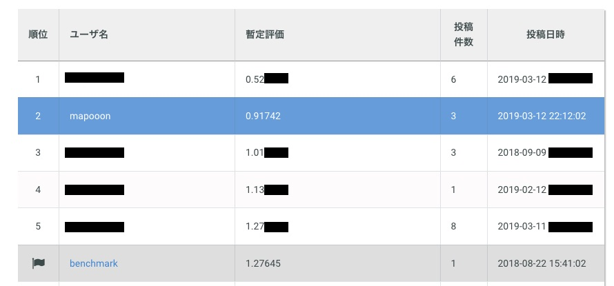

# SIGNATE 【練習問題】画像ラベリング(20種類) Tutorial
  
Competition detail:  
https://signate.jp/competitions/108
***


## Download data  
* Download these files from  above URL.  
    * train.zip
    * test.zip
    * train_master.tsv  

* Unzip train.zip and test.zip.  
* Place files:  
    ```
    signate_image_labeling_20/data/org/train  
    signate_image_labeling_20/data/org/train_master.tsv
    signate_image_labeling_20/data/gen/test/test
    ```

## Preprocess
* Run 
    ```
    signate_image_labeling_20/src/preprocess/separate_data.py
    ```
    For detail, please see comments in separate_data.py.

## Training
* Run 
    ```
    signate_image_labeling_20/src/models/wideresnet/train_gen.py
    ```
    For detail, please see comments in train_gen.py.

## Prediction
* Run 
    ```
    signate_image_labeling_20/src/models/wideresnet/predict_gen.py
    ```
    then submission.csv is generated.  
    For detail, please see comments in predict_gen.py.

## Submission
* Submit submission.csv to above URL.


***
## Source codes for Google Colab
There are source codes for google colab in colab_notebooks/ .  
To use them, upload them on google colab.  
For detail, please see comments in train_gen.ipynb and predict_gen.ipynb.